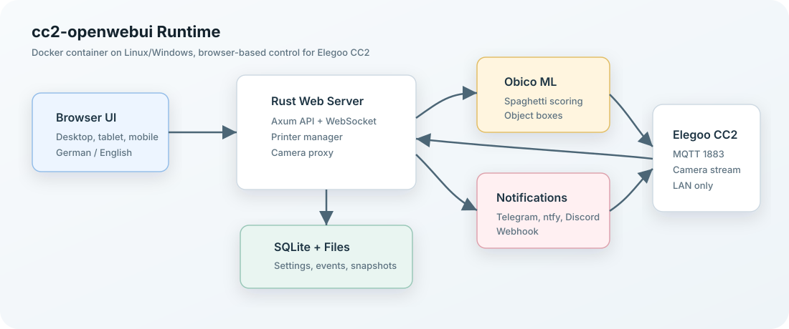
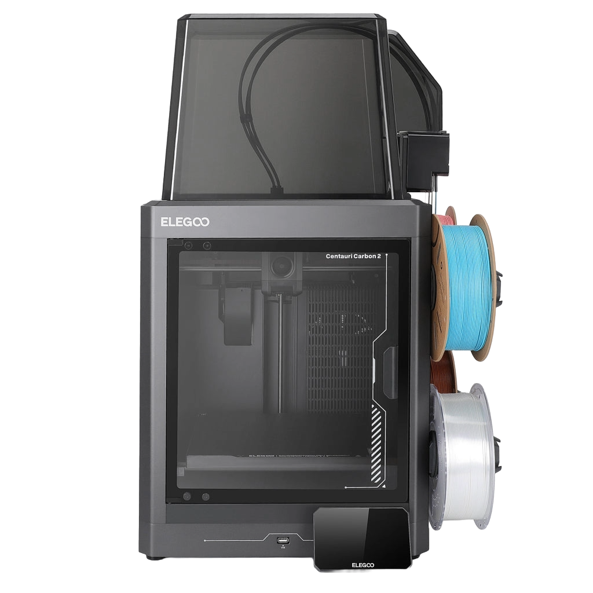
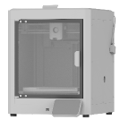
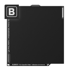
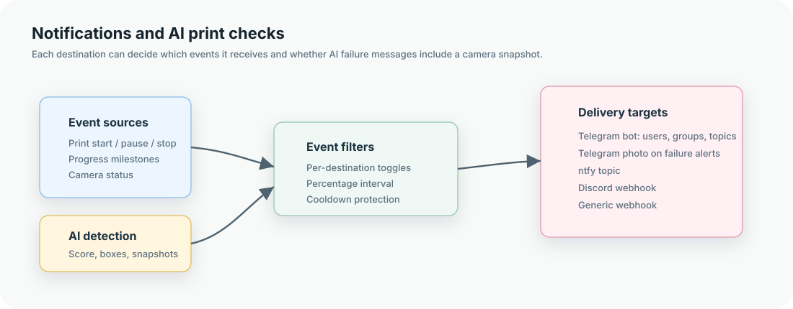

# cc2-openwebui



`cc2-openwebui` is an unofficial, self-hosted web interface for the Elegoo Centauri Carbon / CC2 printer family. This fork is maintained at [CrazyFire66/cc2-openwebui](https://github.com/CrazyFire66/cc2-openwebui) and is designed for local-network printer control, camera monitoring, AI-assisted print failure detection, and configurable notifications.

This README is bilingual:

- [Deutsch](#deutsch)
- [English](#english)

> Safety note: This project can start, pause, resume, and stop real print jobs. The start-print feature is still considered unstable. Always watch the first layer at the printer and do not rely on AI detection as the only safety mechanism.

---

## Deutsch

### Kurzüberblick

`cc2-openwebui` stellt eine moderne Weboberfläche für Elegoo CC2 Drucker im lokalen Netzwerk bereit. Dieser Fork wird unter [CrazyFire66/cc2-openwebui](https://github.com/CrazyFire66/cc2-openwebui) gepflegt. Die Anwendung läuft als Docker-Container, spricht mit dem Drucker über die lokalen Drucker-Schnittstellen, zeigt Status und Kamera an, kann Druckdateien starten, überwacht Drucke mit Obico ML und verschickt Benachrichtigungen über ntfy, Discord, Telegram oder generische Webhooks.

Das Projekt richtet sich an Anwender, die ihren Drucker lieber über eine offene, lokal gehostete Oberfläche bedienen möchten, ohne dafür dauerhaft einen Cloud-Dienst im Mittelpunkt zu haben.

### Projektstatus

Dieses Projekt ist noch jung und einige Funktionen greifen direkt in laufende Druckprozesse ein. Bitte teste Änderungen immer zuerst mit unkritischen Druckjobs.

Wichtige Einschränkungen:

- Der Start eines Druckjobs ist möglich, aber als instabil markiert.
- Beim Starten eines Drucks gibt es eine zusätzliche Sicherheitsbestätigung für die erste Schicht.
- Mehrere Drucker können als Profile gespeichert werden, aber die Live-Steuerung ist aktuell auf einen aktiven Drucker gleichzeitig ausgelegt.
- AI Detection ist ein Assistenzsystem. Es kann Hinweise geben und den Druck pausieren, ersetzt aber keine echte Aufsicht.
- Die Oberfläche ist für mobile Geräte verbessert, sollte aber je nach Bildschirmgröße weiter getestet werden.
- Einige Labels, die direkt aus Firmware- oder Rohstatuswerten kommen, können weiterhin in Englisch erscheinen.

### Bilder

| Bereich | Vorschau |
| --- | --- |
| Drucker |  |
| Offline-Zustand |  |
| Build Plate A |  |
| Build Plate B |  |



### Funktionen

Die Anwendung enthält:

- Weboberfläche für Druckerstatus, Temperatur, Dateien, Kamera und Steuerung
- Onboarding-Assistent für Druckerverbindung, AI Detection und Benachrichtigungen
- Automatische Netzwerksuche nach CC2-Druckern
- Erkennung lokaler Subnetze, zum Beispiel `192.168.150.0/24`
- Anzeige mehrerer Scan-Kandidaten, auch wenn ein Drucker wegen PIN noch nicht vollständig verifiziert werden kann
- Unterstützung für PIN-geschützte Drucker
- PINs mit exakt 6 Zeichen aus Großbuchstaben, Kleinbuchstaben und Zahlen
- Mehrere gespeicherte Druckerprofile
- Umschalten eines aktiven Druckers
- Deutsch/Englisch-Umschaltung in der Oberfläche
- Verbesserte mobile und responsive Darstellung
- Start-Print-Sicherheitsabfrage
- Canvas-Filament-Anzeige, Load/Unload-Aktionen und Slot-Bearbeitung
- Temperatursteuerung für Düse und Heizbett
- Timelapse-Anzeige in der Druckhistorie mit sicherem Download-Proxy, sofern der Drucker idle ist und die Firmware die Datei per HTTP bereitstellt
- Kamera-Snapshot und Kamera-Stream
- Obico-ML-basierte Spaghetti- und Fehldruck-Erkennung
- Detection Score, Objekt-Boxen, Snapshot-Historie und Ignore-Zones
- Separate Warn- und Pause-Schwellenwerte
- Automatische Pause bei bestätigtem Fehler-Risiko
- Benachrichtigungen über ntfy, Discord, Telegram und Webhook
- Telegram-Nachrichten an Personen, Gruppen und optional Foren-Topics
- Telegram-Kommandos für Statusabfragen mit oder ohne Kamerabild
- Optionales Bild bei AI-Fehlermeldungen über Telegram
- Konfigurierbare Status-, Start-, Stopp-, Pause-, Resume- und Fortschrittsmeldungen
- Fortschrittsmeldungen in Prozent-Abschnitten
- JSON-Export und JSON-Import der Einstellungen
- Debug-Seite für Verbindung, Netzwerk, Detection und Notification-Status
- Update-Check
- Apple-Touch-Icon für iPhone/iPad Home-Screen
- Lokale Speicherung von Einstellungen, Events und Detection-Snapshots

### Was AI Detection kann

Die AI Detection verwendet Obico ML, um Kamerabilder während eines laufenden Drucks zu bewerten. Das System holt regelmäßig ein Kamerabild ab, sendet es an den Obico-ML-Endpunkt und verarbeitet die Antwort als Risiko-Score.

Aktuell prüft die Anwendung:

- ob ein laufender Druck aktiv ist
- ob ein aktuelles Kamerabild verfügbar ist
- ob Obico ML einen Fehldruck- oder Spaghetti-Risiko-Score meldet
- ob erkannte Objekt-Boxen vorhanden sind
- ob erkannte Bereiche in einer Ignore-Zone liegen
- ob mehrere Frames hintereinander den Schwellenwert überschreiten
- ob der gleitende Durchschnitt hoch genug ist, um automatisch zu pausieren
- ob Snapshots für Verlauf, Debugging und Telegram-Bilder gespeichert werden sollen

Die AI Detection arbeitet mit zwei Schwellen:

- Notify threshold: Ab diesem Score wird eine Warnung erzeugt.
- Pause threshold: Ab diesem Score kann der Druck automatisch pausiert werden.

Zusätzlich gibt es `confirmation_frames`. Dadurch muss ein Risiko über mehrere Prüfungen hinweg bestätigt werden, bevor eine Warnung oder Pause ausgelöst wird. Das reduziert kurze Fehlalarme durch Lichtwechsel, Bewegungen oder einzelne schlechte Kameraframes.

Wichtig: Die AI erkennt nicht jede mögliche Druckstörung. Sie ist besonders auf visuell erkennbare Fehler wie Spaghetti- oder größere Objektanomalien ausgelegt. Probleme wie schlechte Haftung in den ersten Minuten, verstopfte Düse, falsches Filament, Layer Shift außerhalb des Kamerabereichs oder mechanische Fehler können weiterhin übersehen werden.

### Benachrichtigungen

Benachrichtigungen werden pro Ziel konfiguriert. Jedes Ziel kann eigene Event-Toggles, Fortschrittsintervalle und Snapshot-Optionen haben.

Unterstützte Ziele:

- ntfy
- Discord Webhook
- Telegram Bot
- generischer Webhook

Typische Events:

- Verbindung hergestellt
- Verbindung getrennt
- Druck gestartet
- Druck pausiert
- Druck fortgesetzt
- Druck gestoppt
- Druck abgeschlossen
- Fortschritt erreicht, zum Beispiel 25%, 50%, 75%
- Kamera verloren
- Kamera wiederhergestellt
- AI Detection Warnschwelle erreicht
- AI Detection Pausenschwelle erreicht
- Druck automatisch durch Detection pausiert
- Detection Engine nicht erreichbar
- Not-Stopp
- Maschinenfehler
- ID-Fehler
- Authentifizierungsfehler

Fortschrittsmeldungen sind standardmäßig deaktiviert, weil sie je nach Intervall sehr viele Nachrichten erzeugen können. Wenn du sie aktivierst, kannst du das Intervall pro Ziel setzen, zum Beispiel `10` für 10%-Schritte oder `25` für 25%-Schritte.

### Telegram einrichten

Telegram wird über die offizielle [Telegram Bot API](https://core.telegram.org/bots/api) angebunden.

Vorgehen:

1. Öffne Telegram und starte einen Chat mit `@BotFather`.
2. Erstelle mit `/newbot` einen neuen Bot.
3. Kopiere den Bot Token.
4. Schreibe deinem Bot einmal direkt oder füge ihn einer Gruppe hinzu.
5. Ermittle die Chat ID. Das geht zum Beispiel über einen Bot-API-Aufruf oder über einen Hilfsbot.
6. Trage in `cc2-openwebui` eine neue Telegram-Destination ein.
7. Setze Bot Token und Chat ID.
8. Für Telegram-Forum-Themen kannst du zusätzlich die Topic ID als `message_thread_id` eintragen.
9. Aktiviere optional `Attach camera snapshot to failure messages`.
10. Speichere und sende eine Testnachricht.

Hinweise:

- Chat IDs von Gruppen beginnen häufig mit `-`.
- Supergroup-IDs beginnen oft mit `-100`.
- Der Bot muss Mitglied der Gruppe sein.
- Für Gruppennachrichten benötigt der Bot je nach Gruppen-Setup ausreichende Rechte.
- Topic IDs sind nur für Telegram-Foren relevant.
- Snapshots werden nur angehängt, wenn das Event einen Snapshot hat und die Zieloption aktiv ist.

Telegram-Kommandos:

- `/status` sendet den aktuellen Druckerstatus als Text.
- `/statusbild`, `/bild`, `/snapshot`, `/photo` oder `/statuspic` senden den Status plus aktuelles Kamerabild, falls ein Frame verfügbar ist.
- `/help` zeigt die verfügbaren Kommandos.
- Kommandos werden nur aus der konfigurierten Chat ID beantwortet. Wenn ein Topic gesetzt ist, muss auch die Topic ID passen.

### Mehrere Drucker

Du kannst mehrere Druckerprofile speichern. Jedes Profil enthält:

- Profil-ID
- Anzeige-Name
- IP-Adresse
- Drucker-ID
- optionaler PIN-Code

Die Anwendung nutzt immer einen aktiven Drucker. Beim Umschalten wird die Druckerverbindung neu ausgerichtet und Kamera sowie Status beziehen sich auf den aktiven Drucker.

Aktuelles Modell:

- mehrere Drucker als gespeicherte Profile: ja
- Umschalten zwischen Profilen: ja
- ein aktiver Live-Drucker pro Instanz: ja
- mehrere parallele Live-Dashboards in einer Instanz: noch nicht

Empfehlung für mehrere echte Drucker im Dauerbetrieb:

- Für einfache Nutzung: Profile speichern und aktiv umschalten.
- Für parallele Überwachung: pro Drucker eine eigene Instanz mit eigenem Port und eigenem Docker-Volume starten.

Beispiel:

```yaml
services:
  cc2-openwebui-printer-a:
    image: cc2-openwebui:latest
    container_name: cc2-openwebui-printer-a
    restart: unless-stopped
    network_mode: host
    environment:
      - PORT=8484
    volumes:
      - cc2_openwebui_printer_a:/work

  cc2-openwebui-printer-b:
    image: cc2-openwebui:latest
    container_name: cc2-openwebui-printer-b
    restart: unless-stopped
    network_mode: host
    environment:
      - PORT=8485
    volumes:
      - cc2_openwebui_printer_b:/work

volumes:
  cc2_openwebui_printer_a:
  cc2_openwebui_printer_b:
```

### Voraussetzungen

Empfohlen:

- Linux-Server, Mini-PC, NAS oder Docker-fähiger Host im selben LAN wie der Drucker
- Docker
- Docker Compose
- Netzwerkzugriff vom Host zum Drucker
- Zugriff auf Port `1883` des Druckers im LAN
- Browser auf Desktop, Tablet oder Smartphone

Für Entwicklung:

- Rust Toolchain
- Node.js und npm
- Docker, wenn Obico ML lokal gestartet werden soll

### Schnellstart mit Docker Compose

Linux und die meisten Server:

```bash
git clone https://github.com/CrazyFire66/cc2-openwebui.git
cd cc2-openwebui
docker compose up -d --build
```

Danach öffnen:

```text
http://SERVER-IP:8484
```

Für lokale Tests auf demselben Rechner:

```text
http://127.0.0.1:8484
```

Windows mit Docker Desktop:

```bash
git clone https://github.com/CrazyFire66/cc2-openwebui.git
cd cc2-openwebui
docker compose -f docker-compose.windows.yml up -d --build
```

Windows nutzt Port-Mapping statt `network_mode: host`.

### Server-Deployment

Beispiel für einen Linux-Server:

```bash
ssh root@YOUR-SERVER-IP
mkdir -p /opt/cc2-openwebui
cd /opt/cc2-openwebui
docker compose up -d --build
```

Danach:

```text
http://YOUR-SERVER-IP:8484
```

Wenn du den Code lokal entwickelst und auf den Server kopierst, ist ein typischer Ablauf:

```bash
rsync -a --delete ./ root@YOUR-SERVER-IP:/opt/cc2-openwebui/
ssh root@YOUR-SERVER-IP
cd /opt/cc2-openwebui
docker compose up -d --build
```

### Zweiter Container für einen zweiten Drucker

Für eine zweite parallele Druckerinstanz gibt es `docker-compose.second-printer.yml`. Diese zweite Instanz nutzt ein eigenes Docker-Volume, einen eigenen Web-Port und einen eigenen Obico-ML-Port.

| Instanz | Container | Web UI | Obico ML | Volume |
| --- | --- | --- | --- | --- |
| Drucker 1 | `cc2-openwebui` | `http://YOUR-SERVER-IP:8484` | `http://localhost:3333/p/` | `cc2_openwebui_state` |
| Drucker 2 | `cc2-openwebui-2` | `http://YOUR-SERVER-IP:8485` | `http://localhost:3334/p/` | `cc2_openwebui_state_2` |

Beide Instanzen starten:

```bash
docker compose -f docker-compose.yml -f docker-compose.second-printer.yml up -d --build
```

Nur die zweite Instanz neu starten:

```bash
docker compose -f docker-compose.yml -f docker-compose.second-printer.yml up -d --build cc2-openwebui-2
```

Logs der zweiten Instanz:

```bash
docker logs -f cc2-openwebui-2
```

Danach öffnest du für den zweiten Drucker:

```text
http://YOUR-SERVER-IP:8485
```

Der zweite Container startet mit leerer Konfiguration. Richte den zweiten Drucker dort über das Onboarding ein. Die Daten bleiben getrennt, weil jede Instanz ein eigenes Volume verwendet.

### Daten, Volumes und Pfade

Im Container verwendet die Anwendung `/work` als Arbeitsverzeichnis. Dort liegen unter anderem:

- SQLite-Datenbank
- Konfiguration
- Events
- Detection-Verlauf
- gespeicherte Snapshots

Im Standard-Compose-Setup wird `/work` als Docker-Volume gemountet:

```yaml
volumes:
  - cc2_openwebui_state:/work
```

Dadurch bleiben Einstellungen und Snapshots erhalten, auch wenn der Container neu gebaut wird.

Für mehrere Container können die wichtigsten Ports über Umgebungsvariablen gesetzt werden:

| Variable | Bedeutung | Beispiel |
| --- | --- | --- |
| `CC2_SERVER_HOST` | Host/IP, an die die Web-App bindet | `0.0.0.0` |
| `CC2_SERVER_PORT` | Web-Port der Instanz | `8485` |
| `CC2_OBICO_URL` | Obico-ML-URL, die die Detection nutzt | `http://localhost:3334/p/` |
| `OBICO_PORT` | Port des eingebetteten Obico-ML-Servers | `3334` |
| `CC2_LOG_LEVEL` | Log-Level | `info` |

### Backup und Restore

#### Backup per UI

In den Einstellungen kann die Konfiguration als JSON exportiert und später wieder importiert werden. Das ist besonders praktisch vor größeren Updates oder Tests.

#### Backup per Docker

Container stoppen:

```bash
docker compose down
```

Volume als Archiv sichern:

```bash
docker run --rm \
  -v cc2-openwebui_cc2_openwebui_state:/source:ro \
  -v "$PWD":/backup \
  alpine \
  tar -czf /backup/cc2-openwebui-state-backup.tar.gz -C /source .
```

Wiederherstellen:

```bash
docker compose down
docker run --rm \
  -v cc2-openwebui_cc2_openwebui_state:/target \
  -v "$PWD":/backup \
  alpine \
  sh -c "rm -rf /target/* && tar -xzf /backup/cc2-openwebui-state-backup.tar.gz -C /target"
docker compose up -d
```

#### Quellcode sichern

```bash
tar -czf cc2-openwebui-source-backup.tar.gz .
```

### Drucker finden und verbinden

Die Netzwerksuche läuft in zwei Phasen:

1. Es werden lokale Subnetze erkannt.
2. Innerhalb dieser Subnetze wird nach Geräten gesucht, die auf MQTT-Port `1883` reagieren.
3. Gefundene Kandidaten werden gegen das CC2-Protokoll geprüft.

Wenn ein Drucker PIN-geschützt ist, kann er beim Port-Scan als Kandidat erscheinen, aber noch nicht vollständig verifiziert sein. In diesem Fall PIN eingeben und erneut verifizieren.

PIN-Regeln:

- exakt 6 Zeichen
- erlaubt sind `A-Z`, `a-z`, `0-9`
- Groß- und Kleinschreibung wird beachtet
- Beispiele: `ABC123`, `Abc123`, `abc123`, `000000`
- nicht erlaubt: Leerzeichen, Bindestriche, Sonderzeichen oder andere Längen

Wenn die Suche nichts findet:

- Prüfe, ob Server und Drucker im gleichen Netzwerk sind.
- Prüfe, ob der Drucker eingeschaltet ist.
- Prüfe, ob der Server den Drucker per `ping` erreichen kann.
- Prüfe, ob Port `1883` erreichbar ist.
- Gib die Drucker-IP manuell ein.
- Prüfe die Debug-Seite der Weboberfläche.
- Prüfe Container-Logs mit `docker logs cc2-openwebui`.

### Starten eines Drucks

Beim Start eines Drucks zeigt die Oberfläche eine Sicherheitsabfrage. Das ist absichtlich so, weil ein ferngestarteter Druck riskant sein kann.

Bitte beachte:

- Prüfe Build Plate, Filament und Druckbett vor dem Start.
- Kontrolliere die erste Schicht direkt am Drucker.
- Verlasse dich nicht ausschließlich auf Kamera und AI Detection.
- Stoppe den Druck, wenn die erste Schicht unsauber ist.

### Canvas-Filament

Die Oberfläche zeigt Canvas-Filament-Informationen und erlaubt Bearbeitung, wenn der Drucker die entsprechenden Daten bereitstellt. Diese Funktion ist hilfreich, wenn Materialzuordnung oder Spuleninformationen im UI korrigiert werden sollen.

Unterstützt sind:

- Slot auswählen
- Filament laden
- Filament entladen
- Slot-Daten bearbeiten: Name, Typ, Marke, Filament-Code, Farbe sowie minimale und maximale Düsentemperatur
- Auto-Refill ein- oder ausschalten

Load, Unload und Slot-Bearbeitung sind während eines aktiven oder pausierten Drucks absichtlich gesperrt. Je nach Firmwarestand können außerdem nicht alle Canvas-Kommandos verfügbar sein; in diesem Fall zeigt die Oberfläche die Fehlermeldung des Druckers.

### Temperatursteuerung

Die Temperaturkarte zeigt aktuelle und Zieltemperaturen für Düse, Heizbett und Kammer. Düse und Heizbett können über Eingabefelder oder Presets gesetzt werden:

- Düse: `0` bis `350` °C
- Heizbett: `0` bis `120` °C
- `Off` setzt den Zielwert auf `0`
- PLA/PETG-Presets setzen typische Startwerte

Bitte ändere Temperaturen während eines laufenden Drucks nur bewusst. Die Oberfläche sendet den Zielwert direkt an den Drucker.

### Timelapse-Videos

Die Druckhistorie zeigt Timelapse-Einträge, wenn der Drucker `time_lapse_video_url` meldet. Die Weboberfläche enthält einen sicheren Download-Proxy unter `/api/printer/timelapse`, der den authentifizierten Firmware-Endpunkt `/download?X-Token=...&file_name=...` nutzt und bekannte Fallback-Endpunkte probiert. Der Zugriffscode bleibt dabei serverseitig und wird nicht in der Browser-URL angezeigt.

Timelapse-Videos können laut Drucker-Firmware nur generiert oder heruntergeladen werden, wenn der Drucker nicht beschäftigt ist. Während Druck, Pause, Homing, Preheating, Filament-Operation, Video-Erstellung oder anderen Busy-Zuständen sperren UI und API den Download bewusst mit einer klaren Meldung. Wenn der Drucker idle, completed oder canceled meldet und die Firmware die Datei bereitstellt, wird die MP4 über den Proxy heruntergeladen.

### Kamera und Reconnect

Die Kamera-Verbindung wird erst als aktiv markiert, wenn wirklich ein JPEG-Frame empfangen wurde. Neue Browser-Streams erhalten sofort das letzte bekannte Bild, damit nach einem Reload nicht nur ein schwarzer Frame erscheint. MQTT-Verbindungen setzen ihren internen Connected-Status jetzt auch bei sauber geschlossenen Sessions zurück, sodass der Reconnect-Watcher zuverlässig wieder einen frischen Status abruft.

### Sprache umstellen

Die Oberfläche bietet eine Umschaltung zwischen Deutsch und Englisch. Die Auswahl wird im Browser gespeichert, sodass sie beim nächsten Öffnen erhalten bleibt.

Hinweise:

- Die UI-Texte sind übersetzbar.
- Einige technische Statuswerte können aus Firmware, API oder Logs stammen und bewusst unverändert bleiben.
- Bei neuen Features müssen neue Texte in der Übersetzungsdatei ergänzt werden.

### API-Überblick

Wichtige Endpunkte:

| Endpoint | Beschreibung |
| --- | --- |
| `GET /health` | einfacher Healthcheck |
| `GET /api/setup/check` | Setup-Status |
| `POST /api/setup/scan` | Netzwerk nach Druckern scannen |
| `POST /api/setup/verify` | Drucker-IP und PIN verifizieren |
| `POST /api/setup/save` | Druckerkonfiguration speichern |
| `GET /api/printer/status` | aktueller Druckerstatus |
| `POST /api/printer/print` | Druckjob starten |
| `POST /api/printer/pause` | Druck pausieren |
| `POST /api/printer/resume` | Druck fortsetzen |
| `POST /api/printer/stop` | Druck stoppen |
| `POST /api/printer/temperature` | Düsen- oder Heizbettziel setzen |
| `GET /api/printer/files` | Druckdateien lesen |
| `GET /api/printer/history` | Druckhistorie lesen |
| `GET /api/printer/timelapse` | Timelapse-Datei sicher über die Weboberfläche herunterladen, sofern der Drucker idle ist und die Datei verfügbar ist |
| `POST /api/printer/canvas/load` | gewählten Canvas-Slot laden |
| `POST /api/printer/canvas/unload` | gewählten Canvas-Slot entladen |
| `POST /api/printer/canvas/slot` | Canvas-Slotdaten bearbeiten |
| `POST /api/printer/canvas/auto-refill` | Canvas Auto-Refill setzen |
| `GET /api/camera/snapshot` | aktuelles Kamerabild |
| `GET /api/camera/stream` | Kamerastream |
| `GET /api/detection/status` | Detection-Status |
| `POST /api/detection/config` | Detection konfigurieren |
| `POST /api/detection/run` | manuelle Detection ausführen |
| `GET /api/notifications/destinations` | Benachrichtigungsziele lesen |
| `POST /api/notifications/destinations` | Benachrichtigungsziel anlegen |
| `POST /api/notifications/destinations/:id/test` | Testnachricht senden |
| `GET /api/settings/export` | Konfiguration exportieren |
| `POST /api/settings/import` | Konfiguration importieren |
| `GET /api/debug` | Debug-Status |
| `GET /ws` | WebSocket für Live-Status |

### Entwicklung lokal

Backend:

```bash
cargo run
```

Frontend:

```bash
cd frontend
npm install
npm run dev
```

Frontend bauen:

```bash
cd frontend
npm run build
```

Tests:

```bash
cargo test --locked
```

Docker-Image bauen:

```bash
docker compose build
```

### Troubleshooting

#### Die Weboberfläche ist nicht erreichbar

Prüfe:

```bash
docker ps
docker logs cc2-openwebui
curl http://127.0.0.1:8484/health
```

Wenn du von einem anderen Gerät zugreifst:

- Nutze die Server-IP statt `127.0.0.1`.
- Prüfe Firewall-Regeln.
- Prüfe, ob Port `8484` erreichbar ist.

#### Netzwerk-Scan findet keinen Drucker

Mögliche Ursachen:

- Drucker und Server sind nicht im gleichen VLAN/Subnetz.
- Port `1883` wird blockiert.
- Der Drucker ist im Energiesparmodus oder nicht vollständig im Netzwerk.
- Docker läuft ohne passenden Netzwerkmodus.
- Unter Windows ist Host-Networking anders als unter Linux.

Lösungen:

- Drucker-IP manuell eintragen.
- Unter Linux `network_mode: host` verwenden.
- Unter Windows `docker-compose.windows.yml` verwenden.
- Debug-Seite prüfen.

#### PIN funktioniert nicht

Prüfe:

- exakt 6 Zeichen
- nur Buchstaben und Zahlen
- Groß- und Kleinschreibung korrekt
- keine Leerzeichen am Anfang oder Ende

#### Telegram sendet nicht

Prüfe:

- Bot Token korrekt
- Chat ID korrekt
- Bot hat den Chat bereits gesehen
- Bot ist Mitglied der Gruppe
- Gruppen-ID enthält ggf. führendes `-` oder `-100`
- Topic ID nur verwenden, wenn es wirklich ein Forum-Topic ist
- Container hat Internetzugriff

#### AI Detection läuft nicht

Prüfe:

- Obico ML Container läuft.
- Detection URL ist korrekt, standardmäßig `http://localhost:3333`.
- Kamera liefert ein Bild.
- Ein Druck läuft aktiv.
- Detection ist in den Einstellungen aktiviert.
- Logs enthalten keine Detection Engine Errors.

### Sicherheit

Dieses Projekt ist für das lokale Netzwerk gedacht.

Empfehlungen:

- Nicht ohne Authentifizierung direkt ins Internet stellen.
- Für externen Zugriff lieber VPN, Tailscale, WireGuard oder einen abgesicherten Reverse Proxy verwenden.
- Telegram Bot Token geheim halten.
- Exportierte JSON-Konfigurationen vertraulich behandeln, da dort Tokens und Drucker-PINs enthalten sein können.
- Regelmäßig Backups erstellen.
- Nach Updates mit kleinen Testdrucken prüfen.

### Roadmap-Ideen

Mögliche nächste Ausbaustufen:

- echte parallele Multi-Printer-Ansicht
- Rollen/Rechte oder Login für mehrere Nutzer
- mehrsprachige Übersetzungsabdeckung für alle neuen UI-Texte
- Snapshot-Galerie mit Filter nach Druckjob
- erweiterte AI-Regeln pro Filament, Drucktyp oder Kameraansicht
- zusätzliche Timelapse-Funktionen wie serverseitiges Generieren oder automatische Archivierung
- Webhook-Signaturen
- MQTT-Diagnoseansicht
- Export von Detection-Berichten
- Prometheus-/Grafana-Metriken
- automatische Update-Strategie mit Rollback-Hinweisen

### Fork-Hinweise und Upstream

Dieser Fork ist auf GitHub unter [CrazyFire66/cc2-openwebui](https://github.com/CrazyFire66/cc2-openwebui) zu finden.

Wenn du wiederum einen eigenen Fork veröffentlichst:

- Passe diese README an deinen Fork-Namen an.
- Ergänze Screenshots aus deiner Installation.
- Dokumentiere, welche Drucker-Firmware du getestet hast.
- Entferne private IPs, Tokens, PINs und Chat IDs.
- Füge eine klare Liste bekannter Einschränkungen hinzu.
- Verweise auf diesen Fork oder das Originalprojekt, wenn dein Fork darauf basiert.

### Lizenz

MIT License. Beiträge, Fehlerberichte und Verbesserungen sind willkommen.

### Kontakt und Attribution

Fork:

- GitHub: [CrazyFire66/cc2-openwebui](https://github.com/CrazyFire66/cc2-openwebui)
- Issues: [github.com/CrazyFire66/cc2-openwebui/issues](https://github.com/CrazyFire66/cc2-openwebui/issues)

Upstream:

- Originalprojekt: [DimeusDev/cc2-openwebui](https://github.com/DimeusDev/cc2-openwebui)

---

## English

### Overview

`cc2-openwebui` provides a modern web interface for Elegoo CC2 printers on your local network. This fork is maintained at [CrazyFire66/cc2-openwebui](https://github.com/CrazyFire66/cc2-openwebui). The application runs as a Docker container, connects to the printer through local printer interfaces, shows status and camera feeds, can start print files, monitors prints with Obico ML, and sends notifications through ntfy, Discord, Telegram, or generic webhooks.

The project is intended for users who prefer an open, self-hosted control surface instead of making a cloud service the center of their printer workflow.

### Project Status

This project is still young, and some features directly affect real print jobs. Test updates with non-critical prints first.

Important limitations:

- Starting a print is supported, but still marked as unstable.
- Starting a print requires an additional first-layer safety confirmation.
- Multiple printers can be saved as profiles, but live control currently targets one active printer at a time.
- AI Detection is an assistance system. It can warn and pause, but it does not replace real supervision.
- The UI has been improved for mobile devices, but should still be tested on different screen sizes.
- Some labels coming directly from firmware or raw status values may still appear in English.

### Images

| Area | Preview |
| --- | --- |
| Printer |  |
| Offline state |  |
| Build Plate A |  |
| Build Plate B |  |


### Features

The application includes:

- Web UI for printer status, temperatures, files, camera, and controls
- Onboarding flow for printer connection, AI Detection, and notifications
- Automatic network scan for CC2 printers
- Local subnet detection, for example `192.168.150.0/24`
- Multiple scan candidates, including devices that need a PIN before full verification
- Support for PIN-protected printers
- PINs with exactly 6 characters using uppercase letters, lowercase letters, and numbers
- Multiple saved printer profiles
- Active-printer switching
- German/English language switch
- Improved mobile and responsive layout
- Start-print safety confirmation
- Canvas filament display, load/unload actions, and slot editing
- Nozzle and heated bed temperature controls
- Timelapse entries in print history with a safe download proxy when the printer is idle and firmware exposes the file over HTTP
- Camera snapshot and stream
- Obico ML based spaghetti and print-failure detection
- Detection score, object boxes, snapshot history, and ignore zones
- Separate warning and pause thresholds
- Automatic pause when a failure risk is confirmed
- Notifications through ntfy, Discord, Telegram, and generic webhook
- Telegram messages to users, groups, and optional forum topics
- Telegram commands for status checks with or without a camera image
- Optional Telegram image attachment for AI failure alerts
- Configurable status, start, stop, pause, resume, and progress messages
- Progress notifications by percentage interval
- JSON export and import for settings
- Debug page for connection, network, detection, and notification status
- Update check
- Apple touch icon for iPhone/iPad Home Screen shortcuts
- Local storage of settings, events, and detection snapshots

### What AI Detection Does

AI Detection uses Obico ML to evaluate camera images while a print is running. The system periodically grabs a camera frame, sends it to the Obico ML endpoint, and processes the response as a risk score.

The current implementation checks:

- whether a print is actively running
- whether a current camera frame is available
- whether Obico ML reports a failure or spaghetti risk score
- whether object boxes are present
- whether detected areas are inside an ignore zone
- whether multiple frames in a row exceed the configured threshold
- whether the rolling average is high enough to automatically pause
- whether snapshots should be stored for history, debugging, and Telegram images

AI Detection uses two thresholds:

- Notify threshold: creates a warning event when reached.
- Pause threshold: can automatically pause the print when reached.

The `confirmation_frames` setting requires the risk to be confirmed across multiple checks before warning or pausing. This helps reduce short false positives caused by lighting changes, movement, or a single bad camera frame.

Important: AI Detection will not catch every possible print problem. It is mainly useful for visually obvious failures such as spaghetti or larger object anomalies. Problems like poor first-layer adhesion, a clogged nozzle, wrong filament, layer shifts outside the camera view, or mechanical issues can still be missed.

### Notifications

Notifications are configured per destination. Each destination can have its own event toggles, progress interval, and snapshot option.

Supported destinations:

- ntfy
- Discord webhook
- Telegram bot
- generic webhook

Common events:

- connected
- disconnected
- print started
- print paused
- print resumed
- print stopped
- print finished
- progress milestone, for example 25%, 50%, 75%
- camera lost
- camera restored
- AI Detection notify threshold reached
- AI Detection pause threshold reached
- print auto-paused by detection
- Detection Engine unavailable
- emergency stop
- machine error
- ID mismatch
- authentication error

Progress notifications are disabled by default because they can generate many messages depending on the interval. When enabled, each destination can set its own interval, for example `10` for 10% steps or `25` for 25% steps.

### Telegram Setup

Telegram is integrated through the official [Telegram Bot API](https://core.telegram.org/bots/api).

Steps:

1. Open Telegram and start a chat with `@BotFather`.
2. Create a new bot with `/newbot`.
3. Copy the bot token.
4. Send one message to your bot directly or add it to a group.
5. Find the chat ID, for example through a Bot API request or a helper bot.
6. Add a new Telegram destination in `cc2-openwebui`.
7. Set the bot token and chat ID.
8. For Telegram forum topics, optionally set the topic ID as `message_thread_id`.
9. Optionally enable `Attach camera snapshot to failure messages`.
10. Save and send a test notification.

Notes:

- Group chat IDs often start with `-`.
- Supergroup IDs often start with `-100`.
- The bot must be a member of the group.
- Depending on group settings, the bot may need additional permissions.
- Topic IDs are only relevant for Telegram forum topics.
- Snapshots are only attached when the event has a snapshot and the destination option is enabled.

Telegram commands:

- `/status` sends the current printer status as text.
- `/statusbild`, `/bild`, `/snapshot`, `/photo`, or `/statuspic` send the status plus the latest camera frame when available.
- `/help` shows the available commands.
- Commands are answered only from the configured chat ID. If a topic ID is configured, the topic must match too.

### Multiple Printers

You can store multiple printer profiles. Each profile contains:

- profile ID
- display label
- IP address
- printer ID
- optional PIN code

The application always uses one active printer. When switching the active profile, the printer connection is retargeted and camera/status data refer to the active printer.

Current model:

- multiple saved printer profiles: yes
- switch between profiles: yes
- one active live printer per instance: yes
- multiple parallel live dashboards in one instance: not yet

Recommendation for several printers in daily use:

- For simple workflows: save profiles and switch the active printer.
- For parallel monitoring: run one app instance per printer with its own port and Docker volume.

Example:

```yaml
services:
  cc2-openwebui-printer-a:
    image: cc2-openwebui:latest
    container_name: cc2-openwebui-printer-a
    restart: unless-stopped
    network_mode: host
    environment:
      - PORT=8484
    volumes:
      - cc2_openwebui_printer_a:/work

  cc2-openwebui-printer-b:
    image: cc2-openwebui:latest
    container_name: cc2-openwebui-printer-b
    restart: unless-stopped
    network_mode: host
    environment:
      - PORT=8485
    volumes:
      - cc2_openwebui_printer_b:/work

volumes:
  cc2_openwebui_printer_a:
  cc2_openwebui_printer_b:
```

### Requirements

Recommended:

- Linux server, mini PC, NAS, or Docker-capable host on the same LAN as the printer
- Docker
- Docker Compose
- Network access from host to printer
- Access to printer port `1883` inside the LAN
- Browser on desktop, tablet, or phone

For development:

- Rust toolchain
- Node.js and npm
- Docker, if you want to run Obico ML locally

### Quick Start with Docker Compose

Linux and most servers:

```bash
git clone https://github.com/CrazyFire66/cc2-openwebui.git
cd cc2-openwebui
docker compose up -d --build
```

Then open:

```text
http://SERVER-IP:8484
```

For local tests on the same machine:

```text
http://127.0.0.1:8484
```

Windows with Docker Desktop:

```bash
git clone https://github.com/CrazyFire66/cc2-openwebui.git
cd cc2-openwebui
docker compose -f docker-compose.windows.yml up -d --build
```

Windows uses explicit port mappings instead of `network_mode: host`.

### Server Deployment

Example for a Linux server:

```bash
ssh root@YOUR-SERVER-IP
mkdir -p /opt/cc2-openwebui
cd /opt/cc2-openwebui
docker compose up -d --build
```

Then open:

```text
http://YOUR-SERVER-IP:8484
```

If you develop locally and copy the code to the server, a typical workflow is:

```bash
rsync -a --delete ./ root@YOUR-SERVER-IP:/opt/cc2-openwebui/
ssh root@YOUR-SERVER-IP
cd /opt/cc2-openwebui
docker compose up -d --build
```

### Second Container for a Second Printer

For a second parallel printer instance, use `docker-compose.second-printer.yml`. The second instance uses its own Docker volume, its own web port, and its own Obico ML port.

| Instance | Container | Web UI | Obico ML | Volume |
| --- | --- | --- | --- | --- |
| Printer 1 | `cc2-openwebui` | `http://YOUR-SERVER-IP:8484` | `http://localhost:3333/p/` | `cc2_openwebui_state` |
| Printer 2 | `cc2-openwebui-2` | `http://YOUR-SERVER-IP:8485` | `http://localhost:3334/p/` | `cc2_openwebui_state_2` |

Start both instances:

```bash
docker compose -f docker-compose.yml -f docker-compose.second-printer.yml up -d --build
```

Restart only the second instance:

```bash
docker compose -f docker-compose.yml -f docker-compose.second-printer.yml up -d --build cc2-openwebui-2
```

Logs for the second instance:

```bash
docker logs -f cc2-openwebui-2
```

Then open the second printer UI:

```text
http://YOUR-SERVER-IP:8485
```

The second container starts with an empty configuration. Set up the second printer through onboarding. Data stays separated because each instance uses its own volume.

### Data, Volumes, and Paths

Inside the container, the application uses `/work` as its working directory. This stores, among other things:

- SQLite database
- configuration
- events
- detection history
- saved snapshots

In the default Compose setup, `/work` is mounted as a Docker volume:

```yaml
volumes:
  - cc2_openwebui_state:/work
```

This keeps settings and snapshots intact even when the container is rebuilt.

For multiple containers, the most important ports can be controlled through environment variables:

| Variable | Meaning | Example |
| --- | --- | --- |
| `CC2_SERVER_HOST` | Host/IP the web app binds to | `0.0.0.0` |
| `CC2_SERVER_PORT` | Web port for the instance | `8485` |
| `CC2_OBICO_URL` | Obico ML URL used by detection | `http://localhost:3334/p/` |
| `OBICO_PORT` | Port for the embedded Obico ML server | `3334` |
| `CC2_LOG_LEVEL` | Log level | `info` |

### Backup and Restore

#### UI Backup

The settings screen can export the configuration as JSON and import it later. This is useful before larger updates or experiments.

#### Docker Backup

Stop the container:

```bash
docker compose down
```

Archive the volume:

```bash
docker run --rm \
  -v cc2-openwebui_cc2_openwebui_state:/source:ro \
  -v "$PWD":/backup \
  alpine \
  tar -czf /backup/cc2-openwebui-state-backup.tar.gz -C /source .
```

Restore:

```bash
docker compose down
docker run --rm \
  -v cc2-openwebui_cc2_openwebui_state:/target \
  -v "$PWD":/backup \
  alpine \
  sh -c "rm -rf /target/* && tar -xzf /backup/cc2-openwebui-state-backup.tar.gz -C /target"
docker compose up -d
```

#### Source Backup

```bash
tar -czf cc2-openwebui-source-backup.tar.gz .
```

### Finding and Connecting Printers

The network scan works in two phases:

1. Detect local subnets.
2. Probe addresses in those subnets for MQTT port `1883`.
3. Verify found candidates against the CC2 protocol.

If a printer is PIN-protected, it may appear as a candidate during the port scan but fail full verification until the PIN is provided. Enter the PIN and verify again.

PIN rules:

- exactly 6 characters
- allowed characters are `A-Z`, `a-z`, `0-9`
- case-sensitive
- examples: `ABC123`, `Abc123`, `abc123`, `000000`
- not allowed: spaces, hyphens, symbols, or other lengths

If scanning finds nothing:

- Check that server and printer are on the same network.
- Check that the printer is powered on.
- Check whether the server can ping the printer.
- Check whether port `1883` is reachable.
- Enter the printer IP manually.
- Check the Debug page.
- Check container logs with `docker logs cc2-openwebui`.

### Starting a Print

The UI shows a safety confirmation when starting a print. This is intentional because remote print starts can be risky.

Please remember:

- Check build plate, filament, and bed before starting.
- Watch the first layer at the printer.
- Do not rely only on camera and AI Detection.
- Stop the print if the first layer looks wrong.

### Canvas Filament

The UI displays Canvas filament information and allows editing when the printer exposes the corresponding data. This is useful for correcting material assignments or spool information inside the UI.

Supported actions:

- select a slot
- load filament
- unload filament
- edit slot data: name, type, brand, filament code, color, and min/max nozzle temperature
- enable or disable Auto Refill

Load, unload, and slot editing are intentionally disabled during active or paused prints. Depending on firmware version, not every Canvas command may be available; in that case the UI shows the printer/API error.

### Temperature Controls

The temperature panel shows current and target temperatures for nozzle, heated bed, and chamber. Nozzle and bed targets can be changed through input fields or presets:

- nozzle: `0` to `350` C
- heated bed: `0` to `120` C
- `Off` sets the target to `0`
- PLA/PETG presets use typical starting values

Change temperatures during a running print only deliberately. The UI sends the target directly to the printer.

### Timelapse Videos

Print history shows timelapse entries when the printer reports `time_lapse_video_url`. The web UI includes a safe download proxy at `/api/printer/timelapse`; it uses the authenticated firmware endpoint `/download?X-Token=...&file_name=...` and tries known fallback endpoints. The access code stays on the server and is not exposed in the browser URL.

According to the printer firmware behavior, timelapse videos can only be generated or downloaded when the printer is not busy. During printing, pausing, homing, preheating, filament operations, video composition, or other busy states, both UI and API intentionally block the download with a clear message. When the printer reports idle, completed, or canceled and the firmware exposes the file, the MP4 is downloaded through the proxy.

### Camera and Reconnect

The camera connection is marked active only after a real JPEG frame has been received. New browser streams immediately receive the last known frame to reduce black views after reloads. MQTT sessions now reset their internal connected state even after clean disconnects, so the reconnect watcher can request a fresh printer status after reconnecting.

### Language Switching

The UI can switch between German and English. The selection is stored in the browser and restored when the page is opened again.

Notes:

- UI text is translatable.
- Some technical status values may come from firmware, API responses, or logs and intentionally remain unchanged.
- New features should add new labels to the translation dictionary.

### API Overview

Important endpoints:

| Endpoint | Description |
| --- | --- |
| `GET /health` | simple health check |
| `GET /api/setup/check` | setup status |
| `POST /api/setup/scan` | scan network for printers |
| `POST /api/setup/verify` | verify printer IP and PIN |
| `POST /api/setup/save` | save printer configuration |
| `GET /api/printer/status` | current printer status |
| `POST /api/printer/print` | start print job |
| `POST /api/printer/pause` | pause print |
| `POST /api/printer/resume` | resume print |
| `POST /api/printer/stop` | stop print |
| `POST /api/printer/temperature` | set nozzle or bed target |
| `GET /api/printer/files` | read print files |
| `GET /api/printer/history` | read print history |
| `GET /api/printer/timelapse` | safely download a timelapse file through the web UI when the printer is idle and the file is available |
| `POST /api/printer/canvas/load` | load the selected Canvas slot |
| `POST /api/printer/canvas/unload` | unload the selected Canvas slot |
| `POST /api/printer/canvas/slot` | edit Canvas slot data |
| `POST /api/printer/canvas/auto-refill` | set Canvas Auto Refill |
| `GET /api/camera/snapshot` | current camera frame |
| `GET /api/camera/stream` | camera stream |
| `GET /api/detection/status` | detection status |
| `POST /api/detection/config` | configure detection |
| `POST /api/detection/run` | run manual detection |
| `GET /api/notifications/destinations` | list notification destinations |
| `POST /api/notifications/destinations` | create notification destination |
| `POST /api/notifications/destinations/:id/test` | send test notification |
| `GET /api/settings/export` | export configuration |
| `POST /api/settings/import` | import configuration |
| `GET /api/debug` | debug status |
| `GET /ws` | live status WebSocket |

### Local Development

Backend:

```bash
cargo run
```

Frontend:

```bash
cd frontend
npm install
npm run dev
```

Build frontend:

```bash
cd frontend
npm run build
```

Run tests:

```bash
cargo test --locked
```

Build Docker image:

```bash
docker compose build
```

### Troubleshooting

#### Web UI is not reachable

Check:

```bash
docker ps
docker logs cc2-openwebui
curl http://127.0.0.1:8484/health
```

When accessing from another device:

- Use the server IP instead of `127.0.0.1`.
- Check firewall rules.
- Check whether port `8484` is reachable.

#### Network scan does not find a printer

Possible causes:

- Printer and server are not in the same VLAN/subnet.
- Port `1883` is blocked.
- The printer is asleep or not fully online.
- Docker is running without the right network mode.
- Host networking works differently on Windows than on Linux.

Solutions:

- Enter the printer IP manually.
- Use `network_mode: host` on Linux.
- Use `docker-compose.windows.yml` on Windows.
- Check the Debug page.

#### PIN does not work

Check:

- exactly 6 characters
- letters and numbers only
- correct uppercase/lowercase spelling
- no leading or trailing spaces

#### Telegram does not send

Check:

- Bot token is correct.
- Chat ID is correct.
- The bot has already seen the chat.
- The bot is a member of the group.
- Group ID may need a leading `-` or `-100`.
- Topic ID should only be used for a real forum topic.
- The container has internet access.

#### AI Detection does not run

Check:

- Obico ML container is running.
- Detection URL is correct, default is `http://localhost:3333`.
- Camera returns a frame.
- A print is actively running.
- Detection is enabled in settings.
- Logs do not show Detection Engine Errors.

### Security

This project is intended for local-network use.

Recommendations:

- Do not expose it directly to the internet without authentication.
- For remote access, prefer VPN, Tailscale, WireGuard, or a secured reverse proxy.
- Keep Telegram bot tokens private.
- Treat exported JSON configurations as sensitive because they may contain tokens and printer PINs.
- Make regular backups.
- After updates, verify behavior with small test prints.

### Roadmap Ideas

Possible next steps:

- true parallel multi-printer dashboard
- users, roles, or login
- broader translation coverage for all new UI text
- snapshot gallery filtered by print job
- advanced AI rules per filament, print type, or camera angle
- additional timelapse features such as server-side generation or automatic archiving
- webhook signatures
- MQTT diagnostics view
- exportable detection reports
- Prometheus/Grafana metrics
- update strategy with rollback notes

### Fork Notes and Upstream

This fork is available on GitHub at [CrazyFire66/cc2-openwebui](https://github.com/CrazyFire66/cc2-openwebui).

If you publish another fork:

- Adjust this README to your fork name.
- Add screenshots from your own installation.
- Document which printer firmware you tested.
- Remove private IPs, tokens, PINs, and chat IDs.
- Add a clear list of known limitations.
- Link back to this fork or the original project if your fork is based on it.

### License

MIT License. Contributions, bug reports, and improvements are welcome.

### Contact and Attribution

Fork:

- GitHub: [CrazyFire66/cc2-openwebui](https://github.com/CrazyFire66/cc2-openwebui)
- Issues: [github.com/CrazyFire66/cc2-openwebui/issues](https://github.com/CrazyFire66/cc2-openwebui/issues)

Upstream:

- Original project: [DimeusDev/cc2-openwebui](https://github.com/DimeusDev/cc2-openwebui)
